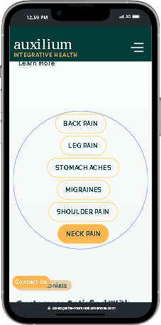

# Osteopathe Montreal React Website

This project is a React.js implementation of the Osteopathe Montreal template. The website showcases the services and information related to Osteopathe Montreal.

## Demo

## 

---# Tech Stack

- : Frontend library for building user interfaces.
- : React rendering library for web applications.
- : Icon library for React applications.
- : Declarative routing for React applications.
- : Animations on scroll library for React.
- : Animated reveal effects library for React.
- : Component for building multi-step forms in React.
- : Scroll component library for React.
- : Scroll to top button component for React.
- : Typewriter effect component for React.
- : Modern touch slider library for React.

**Project Images**

## Contributing

Contributions are welcome! If you'd like to contribute to this project, feel free to open an issue or submit a pull request.

## License

This project is licensed under the [MIT License](LICENSE).

---

## Feel free to customize the content according to your specific project details and requirements.
